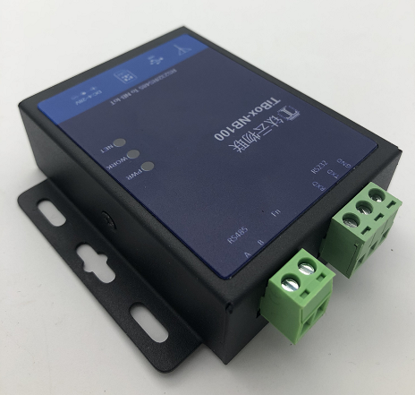

# TiBOX-LTE200  LTE 4G可编程数传控制器开发指南


| 条目       | 说明                                       |
| ---------- | ------------------------------------------ |
| 驱动名称   | TiBox-LTE200 LTE 4G可编程数传控制器         |
| 适用       | 适用于钛云物联TiBox-LTE200 可编程数传控制器 |
| 通讯方式   | RS485                                |
| Java Class | TiLTE200.java                                 |
| 图片       |             |


## TiBox-LTE200  钛极LTE 4G可编程数传控制器

### 产品介绍 

- 支持标准DTU功能
- 支持全网通频段 
- 支持RS232/RS485工业总线接入现场设备 
- 支持扩展GPIO进行联动控制  内置TiJVM Java虚拟机
- 支持用户进行功能扩展 支持通过Java语言进行设备协议解析及控制策略
- 提供标准协议库，如Modbus等等 用户可内置多个应用对应不同的应用场景 
- 支持MQTT协议， 支持多种云平台,
- 支持应用OTA, 可通过云端进行应用动态更新和加载 

### 产品优势

#### 可编程, 更多灵活性

支持通过Java语言进行硬件应用开发, 满足工业现场各种工况需求

#### 更多云平台选择, 更高性价比

工业级高性价比硬件
通过在应用中简单设置即可支持各种云平台

#### 端侧应用动态更新/加载

TiBOX支持OTA功能， 应用策略可通过云端动态加载运行，对未知设备协议具备广泛的适应性
降低云端负荷、平衡端云运算能力
将协议处理，数据转换等处理前置至设备端，充分利用端侧计算能力，有效降低云端负荷

#### 云集中式转换为端云配合分布式采集控制

兼顾现场实时性和云端数据处理需求
降低对网络的依赖性，容灾性更强
端侧控制策略更灵活，无需云端中转即可实现联动

## TiBox-LTE200  编程开发说明

TiBox-LTE200 内置钛极OS(TiJOS) 操作系统， 支持通过JAVA语言进行应用开发，可通过钛极OS(TiJOS) 开发工具链IDE进行应用开发， 具体请参考doc.tijos.net

### TiBox-LTE200 Java类使用 说明

tibox.TiLTE200类提供了TiBOX-LTE200所支持的硬件资源访问， 包括RS485, RS232, 4G, GPIO等等， 用户可通过在TiStudio中进行简单的开发即可支持各种应用， 同时基于钛极OS(TiJOS)支持的MODBUS协议类， 可以很方便地与支持MODBUS RTU协议的设备进行数据交互。 

#### LTE200 主要方法说明

| 方法                                                         | 说明                                                 |
| ------------------------------------------------------------ | ---------------------------------------------------- |
| **网络相关操作**                                             |                                                      |
| void networkStartup()                                        | 启动4G网络接入                                       |
| String networkGetIMEI()                                      | 获取模组IMEI                                         |
| int networkGetRSSI()                                         | 获取RSSI信号强度                                     |
| int networkGetIMSI()                                         | 获取SIM卡IMSI                                        |
| **串口相关操作**                                             |                                                      |
| TiSerialPort getRS485(int baudRate, int dataBitNum, int stopBitNum, int parity) | 获取RS485接口， 参数：波特率，数据位，停止位，校验位 |
| **MQTT网络操作**  MQTTClient类                               |                                                              |
| void connect(MQTTConnectOptions options)                   | 通过MQTT连接云平台 |
| void disconnect()     | 断开MQTT连接 |
| void subscribe(int qos, String... topics)                     | 订阅1个或多个topic           |
| int publish(String topic, String message, int qos, boolean retained)                     | 发布topic数据           |
| **MQTT 事件处理** IMQTTEventListener                                              |                                                              |
| void onPublishDataArrived(int msgId, String topic, String message)                   | 收到MQTT订阅TOPIC数据事件 |
| void onLinkLost(int error)                                                             |  MQTT 连接断开事件                                                            |
| **LED灯控制**                                                |                                                              |
| void turnOnSysLED() /turnOffSysLED                           | 打开/关闭系统LED灯                                                    |
| void void turnOnUserLED(int id)/void turnOffUserLED(int id)                                            | 打开/关闭用户LED灯                                                    |
|                                                              |                                                              |

#### TiSerialPort  串口类主要方法使用说明

通过getRS485获取串口后，即可对串口进行读写操作

| 方法                                                         | 说明                                                         |
| ------------------------------------------------------------ | ------------------------------------------------------------ |
| void write(byte [] buffer ,int start ,int length)            | 写入数据到串口 buffer: 待写入数据  start  缓存区开始位置 length 写入长度 |
| boolean readToBuffer(byte[] buffer, int start, int length, int timeOut) | 从串口读取指定长度数据  buffer: 读入数据缓存区，start 缓存区开始位置 ，length 读取长度 ， timeOut超时，单位毫秒 |
| byte [] read(int msec)                                       | 从串口读数据, msec 最大毫秒数， 当有数据时从串口指定时间的数据返回， 如果没有数据则返回null |
|                                                              |                                                              |


#### 代码调用过程

下面以钛极云平台为例，通过MODBUS获取温湿度状态并通过COAP协议上报至云平台， 用户也可搭建自己的COAP服务器进行测试。

1. 启动网络

  ```java
  //4G注网
  lte200.networkStartup();
  ```

  

2. 打开RS485并获取TiSerialPort对象

  ```java
   //通讯参数
   TiSerialPort rs485 = NB200.getRS485(9600, 8, 1, TiUART.PARITY_NONE);
  ```

3. 创建MODBUS协议对象并挂接RS485

   ```java
   //MODBUS 客户端  
   //通讯超时2000 ms 
   ModbusClient modbusRtu = new ModbusClient(rs485);
   ```

4. 连接MQTT网络

    ```java
    
    //MQTT客户端
    MQTTClient mqtt = lte200.getMQTTClient("mqtt.tijcloud.com", 1833, MQTTClient.generateClientId());
    
    //设置回调事件
    mqtt.setEventListener(new MQTTEventListner());
    
    //连接MQTT服务器
    MQTTConnectOptions options = new MQTTConnectOptions();
    mqtt.connect(options);
    
    ```

5. 通过MODBUS协议读取寄存器数据 

   ```java
      // MODBUS Server 设备地址
      int serverId = 1;
      // Input Register 开始地址
      int startAddr = 0;
      // Read 2 registers from start address 读取个数
      int count = 2;
      
      //读取Holding Register 
      modbusRtu.InitReadHoldingsRequest(serverId, startAddr, count);
      int result = modbusRtu.execRequest();
      
      //读取成功进行数据解析
      if (result == ModbusClient.RESULT_OK) {
          //获取第1个寄存器值 - 温度
      	int temperature = modbusRtu.getResponseRegister(modbusRtu.getResponseAddress(), false);
          //获取第2个寄存器值 - 湿度
      	int humdity = modbusRtu.getResponseRegister(modbusRtu.getResponseAddress() + 1, false);
      }
      
   ```

6. 将数据上报至云平台

7. ```java
   //与设备相关URI
   String productKey = "TiBox-LTE200";
   String pubtopic = "/topic/" + product + "/" + lte200.networkGetIMEI() + "/data";
   
   //数据格式使用JSON格式
   String dataBuffer = "{temperature:" + temperature / 10 + ",humidity:" + humidity / 10 +",rssi:"+ NB200.networkGetRSSI()+ "}";
   
   //发送数据到指定的资源路径
   mqtt.publish(pubtopic, dataBuffer, 1, false);
   
   ```

   在IMQTTEventListener事件中处理订阅TOPIC事件


## 附：MODBUS 协议类使用说明

| 条目       | 说明                                  |
| ---------- | ------------------------------------- |
| 驱动名称   | MODBUS RTU Client                     |
| 适用       | 该驱动适用于符合MODBUS RTU 协议的设备 |
| 通讯方式   | RS485/RS232/UART                                   |
| Java Class | ModbusClient.java                     |
| 图片       |                                       |


## 主要接口

| 函数                                                         | 说明                                                         |
| ------------------------------------------------------------ | ------------------------------------------------------------ |
| ModbusClient(TiSerialPort rs485,  int timeout, int pause)    | 实初化， timout: 通讯超时，pause: 发送命令后等待时间后开始读取数据 |
| InitReadCoilsRequest(int serverId, int startAddress, int count) | 初始化Read Coils 请求                                        |
| InitWriteCoilRequest(int serverId, int coilAddress, boolean value) | 初始化WRITE COIL register 请求- 单寄存器操作                 |
| InitWriteCoilsRequest(int serverId, int startAddress, boolean[] values) | 初始化WRITE MULTIPLE COILS registers 请求- 多寄存器操作      |
| InitReadHoldingsRequest(int serverId, int startAddress, int count) | 初始化READ HOLDING REGISTERs 请求                            |
| InitReadDInputsRequest(int serverId, int startAddress, int count) | 初始化READ DISCRETE INPUT REGISTERs 请求                     |
| InitReadAInputsRequest(int serverId, int startAddress, int count) | 初始化READ INPUT REGISTERs 请求                              |
| InitWriteRegisterRequest(int serverId, int regAddress, int value) | 初始化WRITE SINGLE REGISTER 请求 - 单寄存器操作              |
| InitWriteRegistersRequest(int serverId, int startAddress, int[] values) | 初始化WRITE MULTIPLE 请求 - 多寄存器操作                     |
| int execRequest()                                            | 执行MODBUS 请求并获得响应                                    |
| int getExceptionCode()                                       | 获得返回的MODBUS异常码                                       |
| int getResponseAddress()                                     | 获取返回数据的开始地址                                       |
| int getResponseCount()                                       | 获取返回数据寄存器个数                                       |
| boolean getResponseBit(int address)                          | 获取指定地址COIL寄存器值                                     |
| int getResponseRegister(int address, boolean unsigned)       | 获取指定地址InputRegister/HoldingRegister的值， unsigned: 返回值 为无符号或有符号16位 |
| float getResponseRegisterFloat(int address, boolean bigEndian) | 获取指定地址InputRegister/HoldingRegister的32位浮点值,bigEndian 是否大端 |
| int getResponseRegisterInt32(int address, boolean bigEndian) | 获取指定地址InputRegister/HoldingRegister的int32值，bigEndian是否大端 |


## 使用方法

### 第一步 ：RS485 初始化

获取TiBox-LTE200的RS485对象

```java
		// 485端口
		// 通讯参数 9600，8，1，N
		TiSerialPort rs485 = NB200.getRS485(9600, 8, 1, TiUART.PARITY_NONE);

```

### 第二步:  MODBUS  客户端设置

创建ModbusClient对象， 设置RS485及通讯参数

```java
		// Modbus 客户端
		// 通讯超时2000 ms 读取数据前等待5ms
		ModbusClient mc = new ModbusClient(rs485, 2000, 5);
```

### 第三步：操作寄存器

进行寄存器操作，步骤：

1. 通过InitXXXRequst初始化参数，
2. execRequest执行请求，并获取响应
3. getResponseRegister

```java
//初始读取Holding Register参数， 设备地址， 寄存器开始地址， 个数
mc.InitReadHoldingsRequest(serverId, startAddr, count);	
//执行请求
int result = mc.execRequest();
//执行成功
if (result == ModbusClient.RESULT_OK) {
    	//解析寄存器地址及值(无符号或有符号)
		int humdity = mc.getResponseRegister(mc.getResponseAddress(), false);
		int temperature  = mc.getResponseRegister(mc.getResponseAddress() + 1, false);
}
```